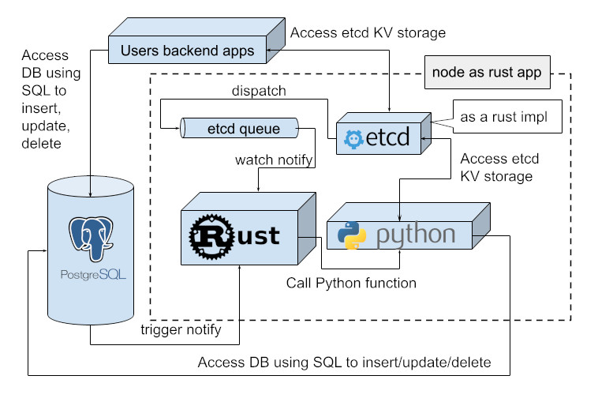

# [Articles](https://vkrinitsyn.github.io)


## Schema guard
[link](/sg1#schema-guard) 
Declarative and Imperative (Flyway inspired) DB schema management.   
[This](https://github.com/vkrinitsyn/schema_guard) Rust based opensource project is a portion of [SchemaGuard](/sg1#schema-guard) complete commercial solution. 
- Designed for embed schema into Rust code.
- Support flexible schema updates if required
- Does not require history table

## RPPD Rust-Python-Postgres-Discovery
Now with etcd queueing:



[link](/rppd#rppd---rust-python-postgres-discovery) 
Rust-Python-Postgres-Discovery.
Serverless platform for run Python code with Postgres:
- Postgres extension with a trigger to notify backend service about a insert or update or delete event
- Rust based opensource project with languages support (i18n)


## Concurrent document modification
[link](https://medium.com/@v.krinitsyn/concurrent-document-modification-ea1b6e628e2d)
When two or more users intend to modify the same JSON document in same row, they will face a delay or data corruption, but actually it’s possible to perform with a patching model.


## YaXaHa
[link](/yt#yaxaha)
MVP of Postgres based cluster governed by RAFT algorithm:
- XA transaction based data consistency guqranee
- HA (High-availability) - no dedicated single master as entry point  
- uses standard (vanilla) PostgreSQL server with extention AND optional patched PGbouncer


## ETCD 
[link](/etcd#etcd)
Etcd server PoC for messaging queue   
- etcd API v3 compatible client using protobuf
- Lightweight [queue](https://github.com/vkrinitsyn/etcd/blob/main/queue.md) with order and delivery guarantee
- Rust based opensource project


## Tools

### Marg - MetaArgs for console rust apps
[link](https://github.com/vkrinitsyn/marg) 
Fewer application configuration to connection to database and store everything else in DB.
- Available as cargo dependency in Rust:
  ``` marg = "0.3.0" ```

### Shims
[link](https://github.com/vkrinitsyn/shim/) - Calculate sliding average
Percentile and bucket size configuration support for histogram calculation.
