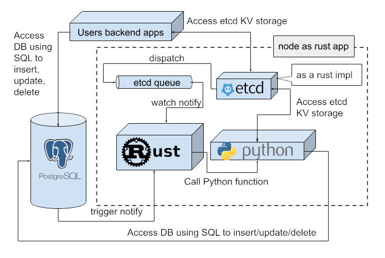

# [Articles](https://vkrinitsyn.github.io)


## YaXaHa
[link](/yt#yaxaha)
The cluster like in cloud, but better, and yours: vanilla PostgreSQL plus an extension.
No forked engine, no dedicated master, no vendor lock &mdash; [dbinvent.com/cluster](https://dbinvent.com/cluster/)
- **Strong consistency on write, eventual on read** - always readable, and writes wait only for what correctness requires
- **Virtual dynamic partitioning** - transaction boundaries are derived at runtime, so disjoint writes spread across nodes
- **RAFT consensus, not a single entry point** - the coordinator arbitrates and assigns workers, it never becomes the bottleneck
- **Synchronization as configuration** - per-table rules decide what is redundant, what is local, and how strong each commit has to be
- **Software-defined topology** (AZ, zones, tiers) - replication scope and row placement are rules, rewritten online with no redeploy or downtime
- **Self-healing** - continuous placement verification, online partition migration, and recovery that repairs rather than reports
- **MPP via Apache DataFusion** - analytics planned against the declared topology, reachable from server functions and cluster-synced tables

Measured, not asserted: **1.7x the throughput (171%)** of PostgreSQL synchronous replication on a write-only load and **1.6x (162%)** on an 80/20 mix, at equal replication scope.
[What replication actually costs](https://dbinvent.github.io/yaxaha-cluster-performance.html) &middot; [Where Rows Live](https://dbinvent.github.io/where-rows-live.html) &middot; [CAP](/cap.md)


## Schema guard
[link](/sg1#schema-guard) 
Declarative and Imperative (Flyway inspired) DB schema management.   
[This](https://github.com/vkrinitsyn/schema_guard) Rust based opensource project is a portion of [SchemaGuard](/sg1#schema-guard) complete commercial solution. 
- Designed for embed schema into Rust code.
- Support flexible schema updates if required
- Does not require history table

## RPPD Rust-Python-Postgres-Discovery
Now with etcd queueing:



[link](/rppd#rppd---rust-python-postgres-discovery) 
Rust-Python-Postgres-Discovery.
Serverless platform for run Python code with Postgres:
- Postgres extension with a trigger to notify backend service about a insert or update or delete event
- Rust based opensource project with languages support (i18n)


## Concurrent document modification
[link](https://medium.com/@v.krinitsyn/concurrent-document-modification-ea1b6e628e2d)
When two or more users intend to modify the same JSON document in same row, they will face a delay or data corruption, but actually it’s possible to perform with a patching model.


## ETCD 
[link](/etcd#etcd)
Etcd server PoC for messaging queue   
- etcd API v3 compatible client using protobuf
- Lightweight [queue](https://github.com/vkrinitsyn/etcd/blob/main/queue.md) with order and delivery guarantee
- Rust based opensource project
 
##  Decentralized Skills Exchange and Mutual Credit Network
[link](/qw/abstract.md#decentralized-skills-exchange-and-mutual-credit-network)
A search-aware framework for discovering and appreciating developers across open source,
startup, and IT projects — without requiring money to change hands.
Participants find each other through verified skill reputation, commit to work via
signed contracts, and compensate contributions with personal credit tokens denominated
in time.

## Tools

### Marg - MetaArgs for console rust apps
[link](https://github.com/vkrinitsyn/marg) 
Fewer application configuration to connection to database and store everything else in DB.
- Available as cargo dependency in Rust:
  ``` marg = "0.4.0" ```

### Shims
[link](https://github.com/vkrinitsyn/shim/) - Calculate sliding average
Percentile and bucket size configuration support for histogram calculation.
- Available as cargo dependency in Rust:
  ``` shims = "0.1.0" ```


---
Other links [DBinvent](https://DBinvent.github.io)
